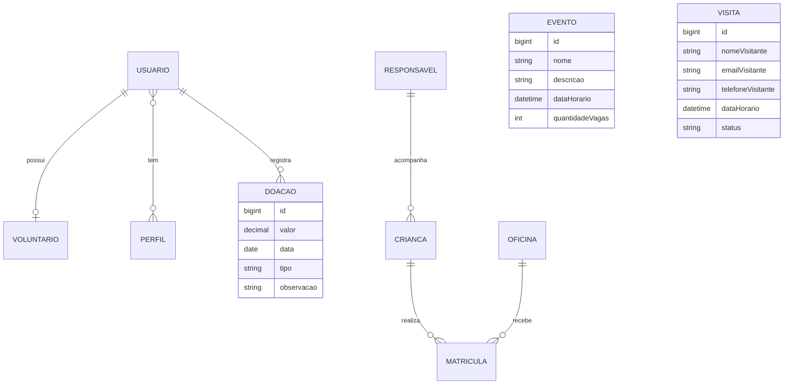

# Parte 2 - DER e entidades JPA

Este arquivo mostra como as tabelas principais do sistema se relacionam.

## DER simplificado

## Relacionamentos

- `Usuario` e `Perfil`: relacionamento N:N. Um usuario pode ter mais de um perfil, por exemplo administrador e voluntario.
- `Usuario` e `Voluntario`: relacionamento 1:1. Um cadastro de voluntario fica ligado a um usuario de login.
- `Usuario` e `Doacao`: relacionamento 1:N. Um usuario pode registrar varias doacoes.
- `Responsavel` e `Crianca`: relacionamento 1:N. Um responsavel pode cadastrar mais de uma crianca.
- `Crianca` e `Oficina`: relacionamento N:N feito pela entidade `Matricula`.
- `Evento`: entidade independente para divulgar e gerenciar eventos.
- `Visita`: entidade independente para agendamento de visitas.

## Regras de negocio no codigo

- RN-001: rotas `/admin/**` exigem perfil de administrador no Spring Security.
- RN-002: `OficinaService.matricularCrianca` verifica se existe vaga antes de criar a matricula.
- RN-003: a comunidade nao recebe a lista completa de menores; dados sensiveis ficam apenas no painel administrativo.

## Entidades JPA criadas

- `Usuario`
- `Perfil`
- `Voluntario`
- `Crianca`
- `Responsavel`
- `Oficina`
- `Matricula`
- `Evento`
- `Doacao`
- `Visita`
